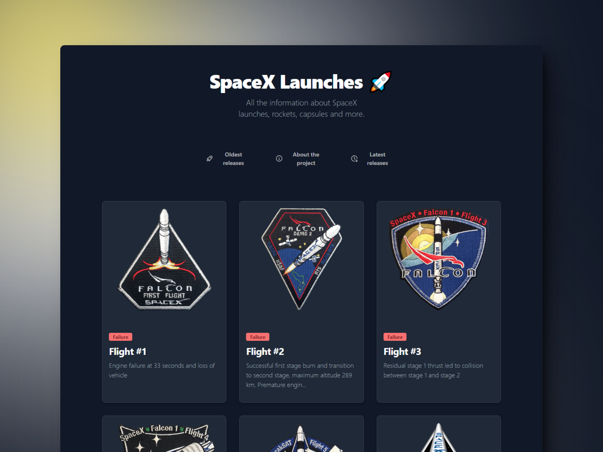

  
# 🚀 Beginning of Astro - SpaceX Launches Project

### 🪐 Este es un proyecto para practicar las últimas funciones y novedades de Astro 3.0.

> 🧩 Aquí puedes ver su [**Live Demo.**](https://spacex-launches-abraham.netlify.app/)

## 🚀 Descripción

Representa información sobre los lanzamientos más recientes de SpaceX mediante su **API**.

Muestra una vista más detallada de cada lanzamiento en una página separada.

## 🎭 Tecnologías

El proyecto utiliza las siguientes tecnologías:

- Obtención de datos de la **API** de SpaceX, validando los datos con **TypeScript**
- Utilizando las **rutas dinámicas** que nos ofrece Astro
- **ViewTransitions** la nueva API de Chrome implementada de manera nativa por este framework
- Estilos y animaciones hechos con **Tailwind**
